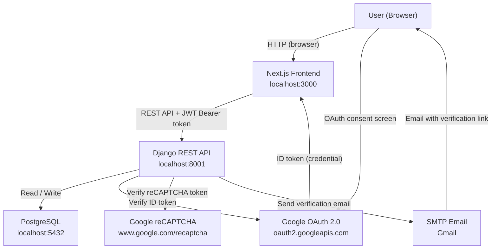
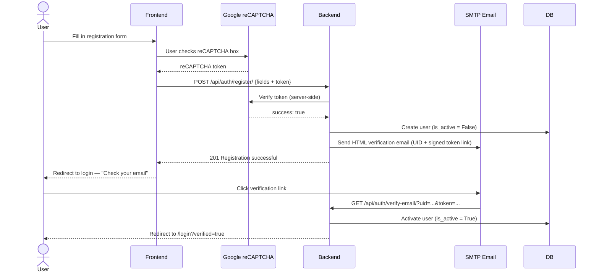
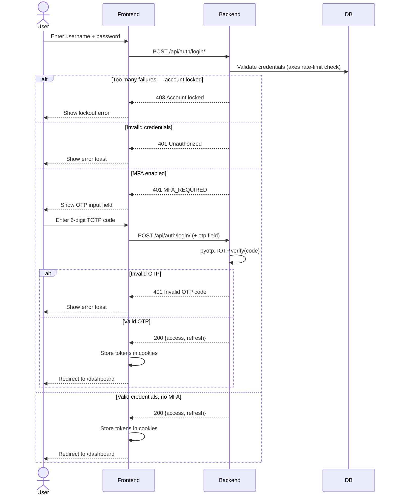
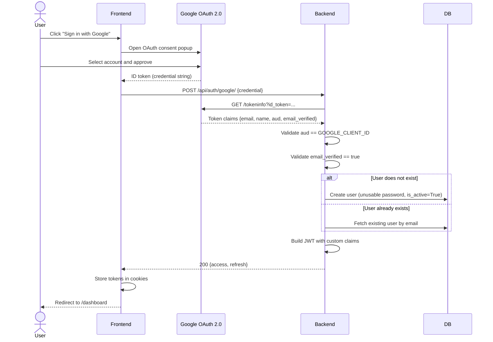
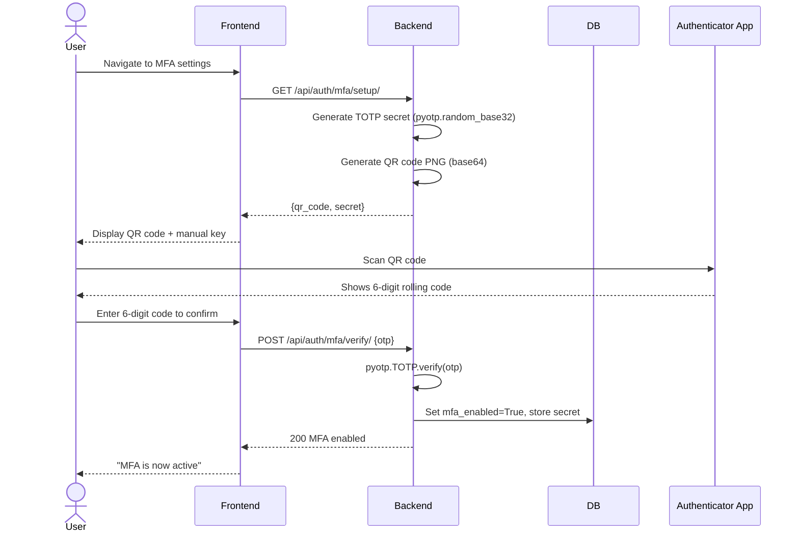

# Assignment Submission: Secure Authentication System

**Course**: Computer System Security
**Student**: Mistire Daniel
**Email**: mistire@10academy.org
**Date**: May 2026

---

## Overview

This submission documents the design and implementation of a **Secure Authentication System** built as part of the Secure Digital Document and Workflow Management System (SDWMS). The assignment required a working authentication system using React, Node.js, JWT, and Google OAuth 2.0. The frontend is built with Next.js 16 (which is React running on a Node.js server), the backend is Django REST Framework, and authentication is handled through a combination of JWT tokens and Google OAuth 2.0 — fulfilling all four required tools.

The authentication system was designed with a defense-in-depth philosophy. Rather than treating authentication as a single gate, each layer of the system independently validates and enforces security: registration is protected by reCAPTCHA and email verification, login is protected by rate limiting and optional MFA, token issuance uses short-lived JWTs with custom claims, and every API request is logged by an audit middleware. The result is a system where compromising one layer does not immediately compromise the whole.

A key design decision was to unify the credential flow between standard login and Google OAuth. After a user authenticates through either path, the backend issues the exact same JWT structure — same custom claims (`username`, `is_staff`, `clearance_level`, `mfa_enabled`, etc.), same token lifetimes, same cookie storage. This means the rest of the application — access control policies, document permissions, workflow rules — works identically regardless of how the user authenticated. The Google OAuth path simply replaces the password verification step with server-side ID token verification against Google's public endpoint.

The system goes beyond the minimum assignment requirements by also implementing TOTP-based Multi-Factor Authentication, a five-model access control system (MAC, DAC, RBAC, RuBAC, ABAC) for document and workflow permissions, and a full audit trail of every API action. These additions reflect the broader context of the system as a secure document management platform, where authentication is the entry point into a much more layered security architecture.

---

## Tools and Technologies Used

| Tool / Technology | Role |
| ----------------- | ---- |
| Next.js 16 (React 19) | Frontend framework (React + Node.js runtime) |
| Django 6.0 + DRF | Backend REST API |
| PostgreSQL 15 | Database |
| JWT (SimpleJWT) | Stateless authentication tokens |
| Google OAuth 2.0 | Social login via `@react-oauth/google` |
| TOTP (pyotp) | Multi-Factor Authentication |
| django-axes | Brute-force login protection |
| reCAPTCHA v2 | Bot protection on registration |
| Docker Compose | Containerized deployment |

---

## System Architecture



**[SCREENSHOT PLACEHOLDER — Architecture diagram]**

---

## Implemented Features

### 1. User Registration

- Username, email, password, phone number, and department fields
- Real-time password strength validation (length, uppercase, lowercase, number, special character)
- reCAPTCHA v2 checkbox to block automated signups
- New accounts are inactive until the user clicks the email verification link
- Django's built-in password validators applied server-side (similarity, min length, common passwords, numeric-only)

**[SCREENSHOT PLACEHOLDER — Registration form with password strength indicators]**

#### Registration Flow



---

### 2. Email Verification

- On registration, a signed UID + token link is emailed to the user using Django's `default_token_generator`
- Clicking the link activates the account and redirects to login with a success toast
- Expired or tampered links show a clear error page

**[SCREENSHOT PLACEHOLDER — Email verification success page]**

---

### 3. JWT-Based Login

- Users authenticate with username + password
- Backend issues a short-lived **access token** (30 min) and a **refresh token** (1 day)
- Tokens carry custom claims: `username`, `is_staff`, `is_superuser`, `department`, `clearance_level`, `mfa_enabled`
- Tokens are stored in browser cookies via `js-cookie`
- Axios request interceptor automatically attaches `Authorization: Bearer <token>` on every API call
- 401 responses clear cookies and redirect to login

**[SCREENSHOT PLACEHOLDER — Login page]**

#### Standard Login Flow



---

### 4. Google OAuth 2.0 Login

- "Sign in with Google" button rendered by `@react-oauth/google`'s `<GoogleLogin>` component
- Frontend receives a Google ID token after the user authenticates with Google
- ID token is posted to `POST /api/auth/google/` — the backend verifies it server-side against Google's `tokeninfo` endpoint
- Backend validates the `aud` claim matches the registered `GOOGLE_CLIENT_ID` to prevent token reuse from other apps
- Email must be marked `email_verified: true` by Google
- New users are created automatically with `set_unusable_password()` — they cannot log in with a password
- Returns the same JWT pair and custom claims as a normal login

**[SCREENSHOT PLACEHOLDER — Login page showing the Google button]**

**[SCREENSHOT PLACEHOLDER — Google OAuth consent screen]**

**[SCREENSHOT PLACEHOLDER — Dashboard after successful Google login]**

#### Google OAuth Flow



---

### 5. Multi-Factor Authentication (TOTP)

- Users enable MFA from their dashboard settings page
- Backend generates a TOTP secret and QR code (base64 PNG) pointing to a `otpauth://` provisioning URI
- User scans with Google Authenticator or Authy and enters the 6-digit code to confirm setup
- On subsequent logins, if `mfa_enabled=True`, the backend returns `MFA_REQUIRED` and the frontend reveals an OTP field
- TOTP codes are verified server-side with a time window tolerance

**[SCREENSHOT PLACEHOLDER — MFA setup page with QR code]**

**[SCREENSHOT PLACEHOLDER — Login page with OTP field visible]**

#### MFA Setup Flow



---

### 6. Brute-Force Protection

- Implemented via `django-axes`
- After **5 failed login attempts**, the account is locked for the configured cooloff period
- Lockout is keyed on both username and IP address to prevent distributed attacks
- Successfully logging in resets the failure counter

**[SCREENSHOT PLACEHOLDER — Login error after failed attempts]**

---

### 7. Audit Logging

- A custom `AuditMiddleware` intercepts every request to `/api/`
- Logs: authenticated user, HTTP method, request path, client IP address, and response status code
- All entries are persisted to the `AuditEntry` database table and visible in the Django admin panel

**[SCREENSHOT PLACEHOLDER — Audit log entries in admin panel]**

---

## Key Files

| File | Purpose |
| ---- | ------- |
| `backend/users/views.py` | `RegisterView`, `CustomTokenObtainPairView`, `GoogleAuthView` |
| `backend/users/serializers.py` | `CustomTokenObtainPairSerializer` — adds custom claims to JWT |
| `backend/users/mfa_views.py` | `MFASetupView`, `MFAVerifyView` |
| `backend/users/urls.py` | All `/api/auth/*` route definitions |
| `backend/config/settings.py` | JWT config, CORS, axes, reCAPTCHA, Google client ID |
| `frontend/lib/auth.ts` | `login()`, `googleLogin()`, `logout()`, `getUser()` helpers |
| `frontend/lib/api.ts` | Axios instance with token injection and 401 handling |
| `frontend/app/(auth)/login/page.tsx` | Login page with Google OAuth button |
| `frontend/components/auth/RegisterForm.tsx` | Registration form with reCAPTCHA and password validation |
| `frontend/app/dashboard/mfa/page.tsx` | MFA setup page |
| `docker-compose.yml` | Full stack container configuration |

---

## Security Considerations

- Passwords hashed with Django's PBKDF2 + salt — never stored in plaintext
- Google OAuth tokens verified **server-side** — the frontend only forwards the credential, it never trusts it
- `aud` claim validation prevents a token issued for another Google app from being accepted
- New OAuth users get `set_unusable_password()` — no password-based login path exists for them
- Short-lived access tokens (30 min) limit the damage window if a token is stolen
- All auth attempts (successes and failures) are captured by audit middleware

---

## How to Run

```bash
git clone <repo>
cd Secure-Digital-Document-and-Workflow-Management-System

# Add your Google Client ID to .env
docker compose up --build
docker compose exec backend python manage.py migrate
```

Open `http://localhost:3000`.
